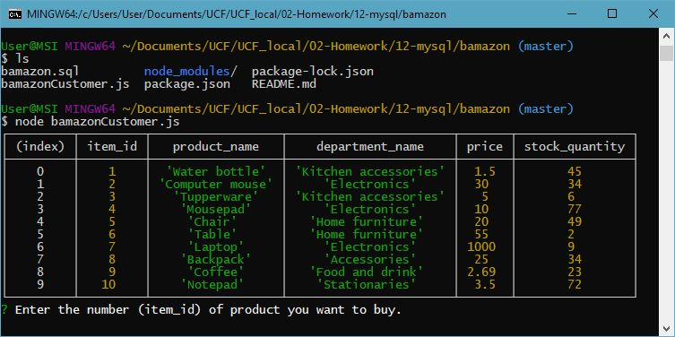
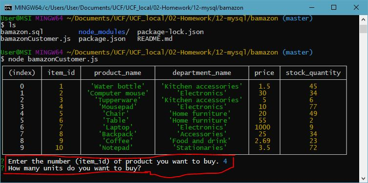
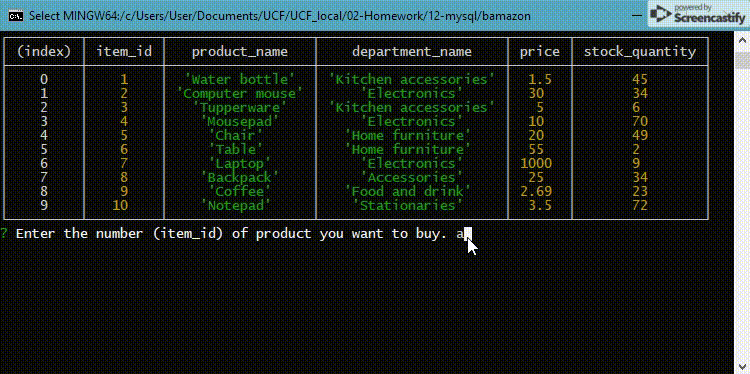
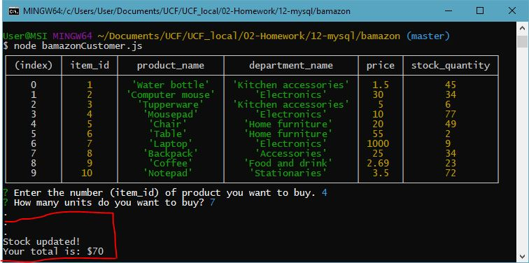

# bamazon
An Amazon-like storefront CLI app written using mySQL and node.js. The app will take in orders from customers and deplete stock from the store's inventory.

## 1. Displaying the products
In the beginning, a table is shown with the following properties:
*Item ID
*Product Name
*Price
*Stock Quantity

## 2. Asking for the item and quantity
The app prompts the user for the item ID of the product he or she wants as well as the quantity of that item.

## 3. Input validation
The app also validates the input, so the input should be an acceptable item ID and the quantity is a number.

## 4. Stock update
Once an acceptable ID and quantity are entered, the app checks the inventory and attempts to update the database. If the buying quantity is less than the number of stock, it'll deduct the amount and display the total cost to the user. If the buying amount exceeds the stock, an error is displayed and will have to try the program again.

